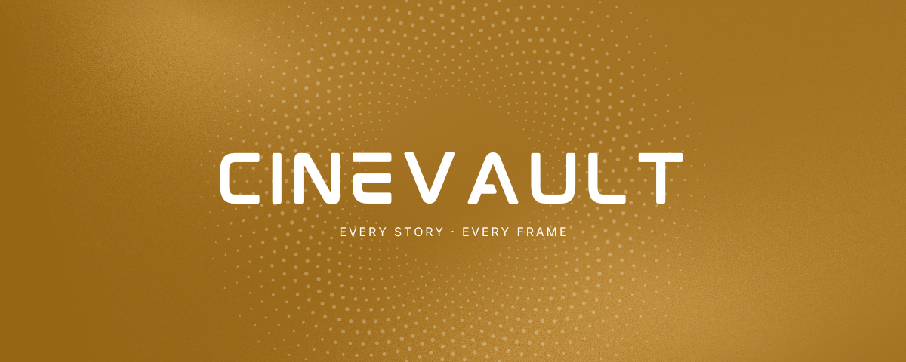
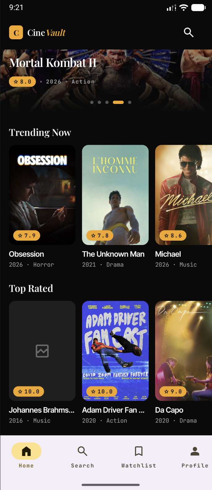
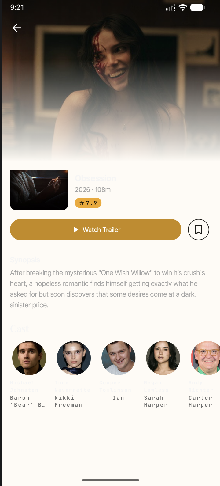
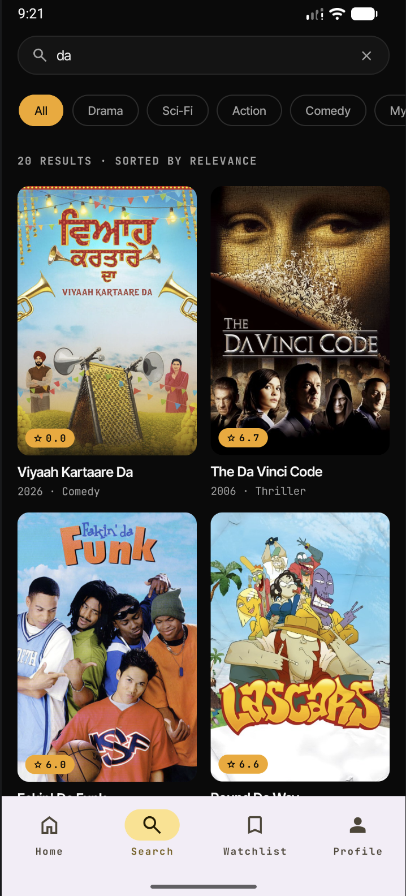
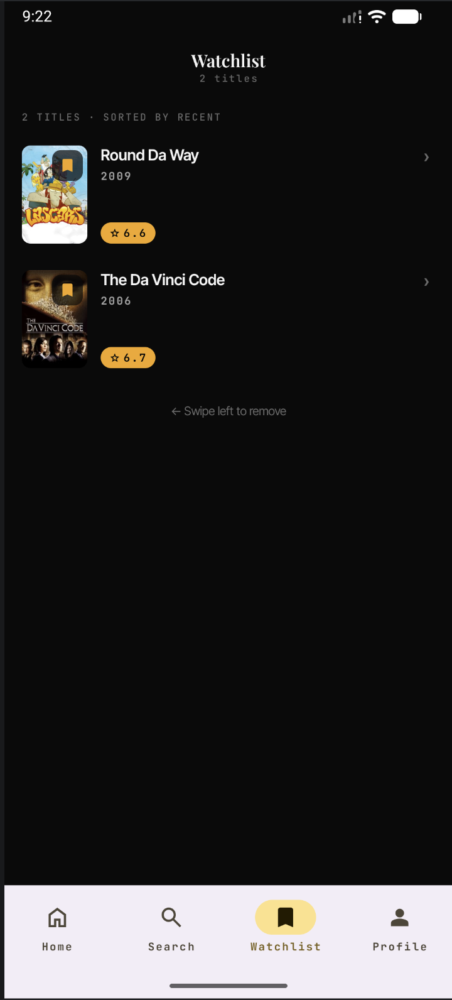
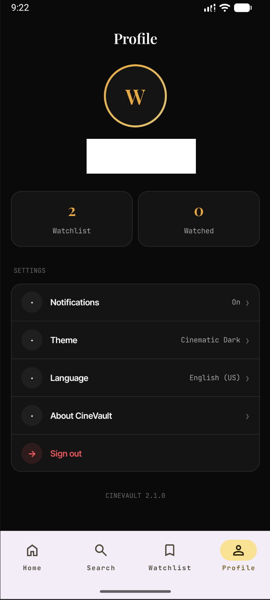
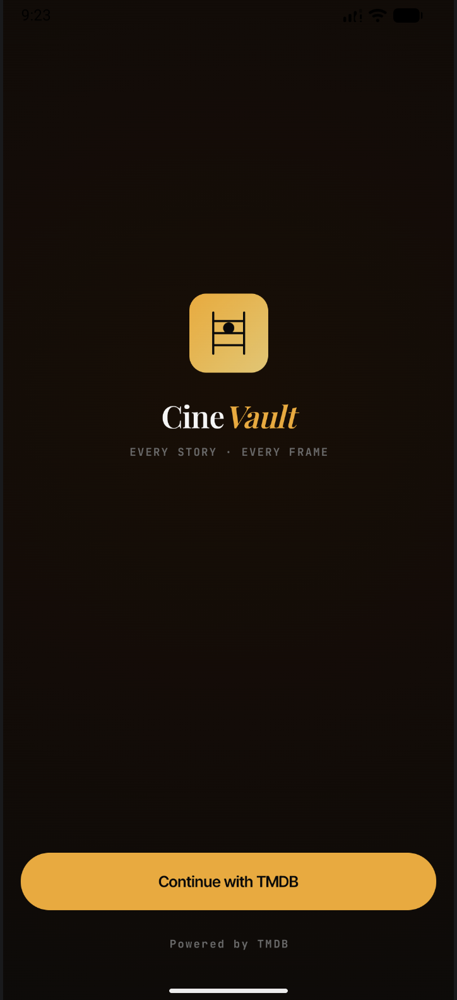

<p align="center">
  <!-- IMAGE NEEDED: Replace with your app logo/banner (recommended: 800×200px PNG with dark background) -->
  
</p>

<h1 align="center">CineVault</h1>

<p align="center">
  An offline-first movie discovery app built as a senior-level Android portfolio project.
  <br/>
  Browse trending films, manage your watchlist, and explore cast details — all with full offline support.
</p>

<p align="center">
  
  
  
  
  
  
</p>

---

## Screenshots

<!-- IMAGE NEEDED: Add screenshots of each screen below.
     Recommended: take them on a Pixel device, dark mode, 1080×2400px.
     Place them in docs/images/ and update the src paths. -->

| Home | Detail | Search |
|------|--------|--------|
|  |  |  |

| Watchlist | Profile | Login |
|-----------|---------|-------|
|  |  |  |

---

## Features

- **Trending & Top Rated** — Home screen hero carousel with auto-scroll and section rows
- **Movie Detail** — Full detail page with backdrop, cast credits, and similar movies
- **Search** — Real-time movie search powered by TMDB
- **Watchlist** — Add/remove movies with offline persistence via Room
- **Profile** — TMDB account info, watchlist stats, and secure logout
- **Offline-first** — Cached data loads instantly; network refreshes in the background
- **Shared element transitions** — Smooth MovieCard → Detail screen animations
- **Shimmer loading states** — Skeleton placeholders matching the exact content shape
- **Secure auth** — TMDB OAuth session flow; session stored encrypted via Tink + DataStore

---

## Tech Stack

| Layer | Library | Version |
|---|---|---|
| Language | Kotlin | 2.3.0 |
| UI | Jetpack Compose + Material3 | BOM 2025.12.01 |
| Architecture | MVI + ViewModel | — |
| Dependency Injection | Koin | 4.2.0-beta2 |
| Networking | Ktor | 3.3.3 |
| Local Database | Room | 2.8.4 |
| Navigation | Navigation3 | 1.1.1 |
| Image Loading | Coil | 2.7.0 |
| Serialization | kotlinx-serialization | 1.9.0 |
| Secure Storage | Tink + DataStore | 1.20.0 / 1.2.0 |
| Background Sync | WorkManager | — |
| Logging | Timber | 5.0.1 |
| Coroutines | kotlinx-coroutines | 1.10.2 |
| Build System | Gradle + AGP | 8.13.2 |

---

## Architecture

CineVault follows **MVI (Model–View–Intent)** with a strict multi-module structure, designed with a future **Kotlin Multiplatform (KMP)** migration in mind.

```
Action (user intent)
      │
      ▼
 ViewModel  ──►  uiEffect: SharedFlow  (one-shot side effects: navigate, snackbar)
      │
      ▼
 uiState: StateFlow
      │
      ▼
   Screen (Compose)
```

Every screen exposes:
- `uiState: StateFlow<UiState>` — sealed `Loading / Success / Error`
- `uiEffect: SharedFlow<Effect>` — navigation and one-shot events

### Data Flow

```
TMDB API (Ktor)
     │
     ▼
Remote DataSource          returns Result<T, DataError>
     │
     ▼
RepositoryImpl             writes to Room on success
     │
     ▼
Room DAO                   emits Flow<Entity>
     │
     ▼
Repository (interface)     maps to domain models via toDomain()
     │
     ▼
UseCase                    pure Kotlin, no Android dependencies
     │
     ▼
ViewModel → Screen
```

Room is the **single source of truth**. The ViewModel never reads from the network directly.

---

## Module Structure

```
MovieApplication/
├── app/                                 → :app (entry point, NavHost, bottom nav)
├── build-logic/convention/              → Gradle convention plugins
│
├── core/
│   ├── data/                            → :core:data        (repositories, mappers, DTOs)
│   ├── database/                        → :core:database    (Room, DAOs, entities)
│   ├── domain/                          → :core:domain      (interfaces, models — pure Kotlin)
│   ├── network/                         → :core:network     (Ktor client, auth plugin)
│   └── presentation/
│       ├── designsystem/                → :core:presentation:designsystem
│       └── ui/                          → :core:presentation:ui
│
└── feature/
    ├── auth/{data,domain,presentation}
    ├── home/{data,domain,presentation}
    ├── detail/{data,domain,presentation}
    ├── search/{data,domain,presentation}
    ├── watchlist/{data,domain,presentation}
    └── profile/{data,domain,presentation}
```

Each feature is split into three layers:
- **domain** — use cases and interfaces (pure Kotlin, zero Android imports)
- **data** — network/database implementations
- **presentation** — Compose screens and ViewModel

Convention plugins enforce the correct dependency graph automatically — no module can depend on another layer it shouldn't know about.

---

## Getting Started

### Prerequisites

- Android Studio Ladybug or newer
- JDK 17+
- A free [TMDB account](https://www.themoviedb.org/signup) and API Read Access Token

### 1. Clone the repository

```bash
git clone https://github.com/waheedshah121/CineVault.git
cd CineVault
```

### 2. Add your TMDB API token

Create a `local.properties` file in the project root (if it doesn't exist) and add:

```properties
sdk.dir=/path/to/your/Android/sdk
API_READ_ACCESS_TOKEN=your_tmdb_read_access_token_here
```

You can get your token from: **TMDB → Settings → API → API Read Access Token (v4 auth)**

### 3. Run

Open the project in Android Studio and run the `app` configuration on a device or emulator (API 24+).

---

## Design System

CineVault ships with a custom design system (`CineVaultTheme`) built on Material3:

- **Spacing tokens** — `CineVaultSpacing.xs/sm/md/lg/xl/xxl/xxxl/huge` — no hardcoded dp values anywhere
- **Radius tokens** — `CineVaultRadius.xs → pill`
- **Animation constants** — `CineVaultAnimation.DURATION_SHORT/MEDIUM/LONG`, `EaseInOutCubic`
- **Typography** — Inter Tight (UI), Playfair Display (editorial), JetBrains Mono (metadata)
- **Semantic color aliases** — `CvSurface`, `CvText`, `CvTextDim`, `CvAmber`, `CvDanger`
- **Reusable components** — `MovieCard`, `MovieCardShimmer`, `RatingBadge`, `GenreChip`, `SectionHeader`, `OfflineBadge`, `SyncStatusIndicator`

---

## Key Architectural Decisions

**Why Ktor over Retrofit?**
Ktor is Kotlin Multiplatform native. When this project migrates to KMP, the network layer requires zero changes.

**Why Koin over Hilt?**
Same reason — Koin supports KMP targets; Hilt is Android-only.

**Why Room as single source of truth?**
Network requests are fire-and-forget background operations. The UI always reads from Room, which means cached data is visible instantly on every launch — even with no internet connection.

**Why Navigation3?**
Navigation3 is the new official Compose-first navigation library from Google, replacing the type-unsafe string route approach of Navigation Compose 2.x.

**Why split into 20+ modules?**
Build speed (only changed modules recompile), enforced layering (the Gradle dependency graph won't compile if you break an architecture rule), and KMP readiness (pure Kotlin modules can be shared across platforms with no changes).

---

## Roadmap

- [ ] `MovieSyncWorker` — periodic WorkManager background sync
- [ ] Macrobenchmark baseline profile for cold start and scroll performance
- [ ] Compose Previews for all screens with realistic mock data
- [ ] Kotlin Multiplatform migration for `core:domain` and `core:data`

---

## API

This app uses the [TMDB API](https://developer.themoviedb.org/docs). You need a free API key to run it. TMDB data is used in accordance with their [terms of use](https://www.themoviedb.org/documentation/api/terms-of-use).

<!-- IMAGE NEEDED: Add the TMDB attribution logo below (required by TMDB terms) -->
<!-- Download from: https://www.themoviedb.org/about/logos-attribution -->
<p>
  
</p>

---

## License

```
MIT License

Copyright (c) 2025 Waheed Shah

Permission is hereby granted, free of charge, to any person obtaining a copy
of this software and associated documentation files (the "Software"), to deal
in the Software without restriction, including without limitation the rights
to use, copy, modify, merge, publish, distribute, sublicense, and/or sell
copies of the Software, and to permit persons to whom the Software is
furnished to do so, subject to the following conditions:

The above copyright notice and this permission notice shall be included in all
copies or substantial portions of the Software.

THE SOFTWARE IS PROVIDED "AS IS", WITHOUT WARRANTY OF ANY KIND, EXPRESS OR
IMPLIED, INCLUDING BUT NOT LIMITED TO THE WARRANTIES OF MERCHANTABILITY,
FITNESS FOR A PARTICULAR PURPOSE AND NONINFRINGEMENT.
```
